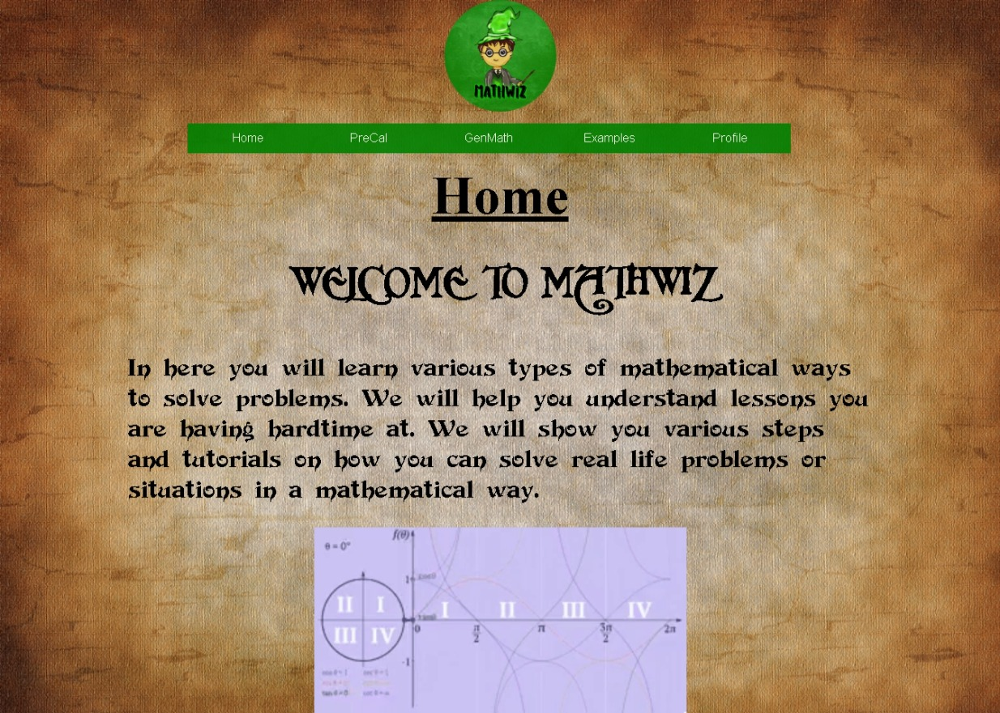

# Mathwiz – Educational Math Website

## Overview
Mathwiz is an educational site designed to help learners understand and practice various mathematical concepts from **Pre‑Calculus** and **General Mathematics.**

The site contains:
- Topic introductions and explanations
- Worked examples
- References to further reading
- A retro‑inspired visual design with a custom logo and themed background

This repository contains the **fully revised HTML5/CSS version** of the original 2019 Mathwiz project. The revision preserves the original look, layout, and interactive features while cleaning the code:

- Removed all inline styles and invalid HTML
- Centralized all styling in `styles.css`
- Preserved original spacing, fonts, and images
- Improved consistency and maintainability

This site also contains faithfully reconstructed archived educational pages from the University of Saskatchewan, preserved to ensure the original information remains accessible.

---

## 📌 Privacy Notice
In this revision, real names, photographs, and contact details of my co-developers from the Profiles page have been replaced with placeholders, making the site safe for public access.

---

## 👥 Team Roles
- **Jasper T. Aviles – Main Developer**  
    **Old Version:**  
    Built the HTML structure, integrated ideas from all team members (CSS, content, and design), debugged HTML/inline styles/CSS, and revised the site to align with the design direction provided by our designer.

    **Latest Version:**  
    Refactored the code to modern HTML5 standards, centralized styles in CSS, and improved maintainability while preserving the original look and functionality.

- **John Andre Jurado – Content**  
    Provided the educational material and determined what information to include in the site.

- **Roberto Polizon Jr. – Main CSS Developer**  
    Suggested CSS in the old version and built the original styling.

- **Patricia May Velasco – Logo and Website Designer**  
    Created the hand‑drawn logo, selected the background image and fonts, and guided the overall visual design.

---

## 📄 Licensing & Usage
This project is for educational use and demonstration purposes only.  
All third‑party content referenced in the **References** section belongs to its respective owners.  
The original team created the custom logo, fonts, and design elements.

---

## 🔍 How to View
To view locally:
1. Download or clone this repository.
2. Open `index.html` in your browser.

GitHub Pages:
[View live site](https://jasperaviles54.github.io/Mathwiz/)

---

## 🖼 Preview
